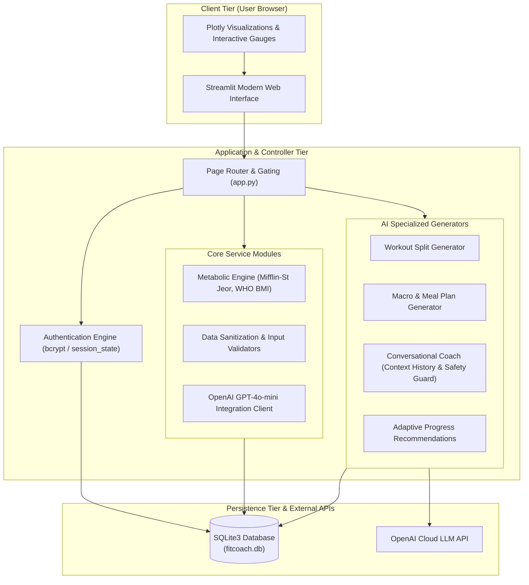

# 🏋️ AI FitCoach — Generative AI Based Personal Fitness Assistant

> **An intelligent, adaptive, science-backed personal fitness, diet, and biometric wellness companion powered by Generative AI and Streamlit.**

[](https://www.python.org/)
[](https://streamlit.io/)
[](https://platform.openai.com/)
[](https://www.sqlite.org/)
[](https://docs.pytest.org/)
[](https://opensource.org/licenses/MIT)

---

## 📑 Table of Contents
- [📌 Problem Statement](#-problem-statement)
- [🏗️ System Architecture](#-system-architecture)
- [🛠️ Technology Stack](#-technology-stack)
- [📂 Modular Project Layout](#-modular-project-layout)
- [🗄️ Database Schema](#-database-schema)
- [⚡ Key Features & Modules](#-key-features--modules)
- [🚀 Quickstart & Setup Guide](#-quickstart--setup-guide)
- [🧪 Running Automated Unit Tests](#-running-automated-unit-tests)
- [☁️ Cloud Deployment Guide](#-cloud-deployment-guide)
- [🖥️ UI Walkthrough & Screenshots](#-ui-walkthrough--screenshots)
- [🎓 Academic Project Details](#-academic-project-details)
- [🔮 Future Scope](#-future-scope)
- [⚠️ Medical & Safety Disclaimer](#-medical--safety-disclaimer)
- [📜 License](#-license)

---

## 📌 Problem Statement

In the modern digital health landscape, individuals pursuing personal fitness and wellness face significant obstacles:
1. **Financial Barriers:** Certified personal trainers and registered dietitians charge \$50–\$150/hour, making professional guidance inaccessible for many students and young professionals.
2. **Static & Impersonal Apps:** Traditional mobile apps provide rigid "cookie-cutter" workout routines and meal plans that do not adapt dynamically to the user's changing schedule, injuries, equipment access, or biometric progress.
3. **Data Fragmentation:** Fitness enthusiasts frequently juggle multiple disjointed tools — one for calorie logging, another for workout recording, a third for step tracking, and web search for training advice.
4. **Misinformation & Lack of Safety Checks:** Online forums and social media offer contradictory fitness advice, often without necessary medical safety warnings or emergency safeguards.

**AI FitCoach** addresses this challenge by delivering a unified, free, and adaptive personal fitness web platform that combines validated exercise physiology algorithms (Mifflin-St Jeor BMR, WHO BMI standards, macro distribution models) with Large Language Models (OpenAI GPT-4o-mini). It offers dynamic workout splits, tailored nutritional meal plans, real-time interactive coaching with emergency safety detection, and longitudinal progress tracking.

---

## 🏗️ System Architecture



### Architectural Highlights
- **Three-Tier Architecture:** Decoupled presentation (`pages/`, `components/`), business/AI logic (`ai/`, `utils/`, `auth/`), and data storage (`database/`).
- **Context-Aware LLM Pipelines:** Prompts dynamically inject user biometric profiles (age, height, weight, target weight, activity multiplier, diet style, injuries) into system instructions.
- **Fail-Safe Offline Operation:** If OpenAI API credentials are unavailable or rate-limited, the system falls back gracefully to deterministic rule-based generators and notifies the user via status badges.

---

## 🛠️ Technology Stack

| Layer | Component | Version / Library | Purpose |
| :--- | :--- | :--- | :--- |
| **Presentation** | Web Application Framework | `Streamlit >= 1.32.0` | Responsive multi-page UI with dark-mode styling |
| **Visualizations**| Data Charts | `Plotly >= 5.19.0` | Dark-themed interactive time-series & adherence gauges |
| **Data Processing**| Analytics | `Pandas >= 2.2.0` | Log dataframes, statistical aggregations, CSV exports |
| **AI Integration**| LLM API Client | `OpenAI >= 1.14.0` | GPT-4o-mini / GPT-3.5-turbo workout, diet, & coach responses |
| **Database** | Relational Database | `SQLite 3` (Built-in) | Serverless local storage; zero cloud database setup required |
| **Security** | Password Hashing | `bcrypt >= 4.1.0` | Industry standard salted password hashing with fallbacks |
| **Environment** | Secrets Management | `python-dotenv >= 1.0.1`| Local `.env` secret loading for secure API key handling |
| **Quality Assurance**| Unit Testing | `pytest >= 8.0.0` | Automated unit testing of math, validators, auth, & database |
| **Deployment** | PaaS Cloud Platforms | Streamlit Cloud / Render | Containerized / cloud hosting with `Procfile` & `runtime.txt` |

---

## 📂 Modular Project Layout

```text
AI-FitCoach/
│
├── app.py                      # Application entrypoint, session controller & navigation router
├── requirements.txt            # Python dependencies specification
├── README.md                   # Complete academic documentation & quickstart guide
├── .env.example                # Sample environment variables template
├── .gitignore                  # Git tracking exclusion definitions
├── Procfile                    # Render / Heroku process configuration
├── runtime.txt                 # Target Python runtime environment (python-3.11.8)
│
├── database/                   # Database Management Layer
│   ├── __init__.py             # Exports CRUD helper methods
│   ├── db.py                   # Parameterized SQLite query operations & connection manager
│   ├── schema.sql              # Relational DDL definitions with foreign keys
│   └── fitcoach.db             # Auto-generated SQLite database file (created on runtime)
│
├── auth/                       # Security & Identity Layer
│   ├── __init__.py             # Exports authentication methods
│   └── auth.py                 # Bcrypt hashing, validation, signup, and login handlers
│
├── ai/                         # Artificial Intelligence & LLM Layer
│   ├── __init__.py             # Exports AI generative services
│   ├── openai_client.py        # Safe OpenAI API client, timeout handler, and key tester
│   ├── workout_generator.py    # Generates structured split workout plans & saves to DB
│   ├── diet_generator.py       # Generates 5-meal macronutrient diet schedules & saves to DB
│   ├── chatbot.py              # Context-aware coach with emergency medical keywords gate
│   └── recommendations.py      # Evaluates 7-30 day progress logs to prescribe adjustments
│
├── utils/                      # Scientific Utilities & Computational Core
│   ├── __init__.py             # Exports calculators and validators
│   ├── bmi.py                  # BMI, WHO classifications, BMR, TDEE, macros, water targets
│   ├── validators.py           # Email regex, username rules, password safety, range bounds
│   ├── helpers.py              # Session validation, date formatting, CSV export helpers
│   └── constants.py            # Global options, fitness splits, tips collection, disclaimers
│
├── pages/                      # Streamlit Application Views
│   ├── __init__.py             # Page components export
│   ├── dashboard.py            # KPI overview, recent logs table, weight chart, quick actions
│   ├── profile.py              # Biometric user profile view and update form
│   ├── bmi_calculator.py       # Interactive BMI & metabolic metrics calculator with gauge
│   ├── workout.py              # Workout split generator and saved routine repository
│   ├── diet.py                 # Meal plan generator and saved dietary schedules
│   ├── chatbot.py              # Chat UI with quick prompts and conversation clearing
│   ├── progress.py             # Daily check-in logging, 5 Plotly charts, milestone metrics
│   └── daily_tip.py            # Cached AI & curated scientific tips across 7 fitness pillars
│
├── components/                 # Reusable Presentation Components
│   ├── __init__.py             # Component exports
│   ├── navbar.py               # Header branding banner with user & API status badges
│   ├── sidebar.py              # Modern navigation sidebar, profile badge, and key settings
│   ├── cards.py                # Reusable glassmorphic metric cards and callout containers
│   └── charts.py               # Reusable Plotly chart builders (weight, water, sleep, steps)
│
├── data/                       # Local Data Persistence
│   └── .gitkeep                # Git tracking keeper for data directory
│
└── tests/                      # Automated Verification & Unit Test Suite
    ├── __init__.py             # Test package export
    ├── test_bmi.py             # Tests for BMI, categories, BMR, TDEE, macros, water
    ├── test_validators.py      # Tests for email, username, password, numeric sanitization
    ├── test_auth.py            # Tests for password hashing, registration, and authentication
    └── test_database.py        # Tests for SQLite tables, CRUD operations, and relations
```

---

## 🗄️ Database Schema

The database uses SQLite3 with relational constraints and foreign keys enabled:

```sql
-- 1. Users Table
CREATE TABLE IF NOT EXISTS users (
    id INTEGER PRIMARY KEY AUTOINCREMENT,
    username TEXT UNIQUE NOT NULL,
    email TEXT UNIQUE NOT NULL,
    password_hash TEXT NOT NULL,
    created_at TIMESTAMP DEFAULT CURRENT_TIMESTAMP
);

-- 2. Profiles Table
CREATE TABLE IF NOT EXISTS profiles (
    user_id INTEGER PRIMARY KEY,
    name TEXT,
    age INTEGER,
    gender TEXT,
    height REAL,
    weight REAL,
    activity_level TEXT,
    fitness_goal TEXT,
    target_weight REAL,
    dietary_preference TEXT DEFAULT 'None',
    medical_notes TEXT DEFAULT '',
    updated_at TIMESTAMP DEFAULT CURRENT_TIMESTAMP,
    FOREIGN KEY(user_id) REFERENCES users(id) ON DELETE CASCADE
);

-- 3. Progress Tracking Table
CREATE TABLE IF NOT EXISTS progress (
    id INTEGER PRIMARY KEY AUTOINCREMENT,
    user_id INTEGER NOT NULL,
    date DATE NOT NULL,
    weight REAL,
    water REAL,
    sleep REAL,
    calories INTEGER,
    workout_completed INTEGER DEFAULT 0,
    steps INTEGER DEFAULT 0,
    notes TEXT,
    created_at TIMESTAMP DEFAULT CURRENT_TIMESTAMP,
    FOREIGN KEY(user_id) REFERENCES users(id) ON DELETE CASCADE
);

-- 4. Workout Plans Table
CREATE TABLE IF NOT EXISTS workout_plans (
    id INTEGER PRIMARY KEY AUTOINCREMENT,
    user_id INTEGER NOT NULL,
    plan TEXT NOT NULL,
    created_at TIMESTAMP DEFAULT CURRENT_TIMESTAMP,
    FOREIGN KEY(user_id) REFERENCES users(id) ON DELETE CASCADE
);

-- 5. Diet Plans Table
CREATE TABLE IF NOT EXISTS diet_plans (
    id INTEGER PRIMARY KEY AUTOINCREMENT,
    user_id INTEGER NOT NULL,
    plan TEXT NOT NULL,
    created_at TIMESTAMP DEFAULT CURRENT_TIMESTAMP,
    FOREIGN KEY(user_id) REFERENCES users(id) ON DELETE CASCADE
);

-- 6. Chat History Table
CREATE TABLE IF NOT EXISTS chat_history (
    id INTEGER PRIMARY KEY AUTOINCREMENT,
    user_id INTEGER NOT NULL,
    role TEXT NOT NULL,
    message TEXT NOT NULL,
    created_at TIMESTAMP DEFAULT CURRENT_TIMESTAMP,
    FOREIGN KEY(user_id) REFERENCES users(id) ON DELETE CASCADE
);
```

---

## ⚡ Key Features & Modules

### 1. Authentication & Security
- **Registration & Login:** Strict validation of email format, username uniqueness, and password strength ($>=6$ characters).
- **Cryptographic Security:** Salted hashing using `bcrypt` (12 rounds) with PBKDF2 fallback.
- **Session Management:** Secure Streamlit session isolation (`logged_in`, `user_id`, `username`, `email`).

### 2. Metabolic Engine & Biometrics
- **WHO BMI Standard:** Accurate formula $\text{BMI} = \text{weight} / (\text{height}/100)^2$ rounded to 2 decimal places with categories: *Underweight (<18.5)*, *Normal (18.5–24.9)*, *Overweight (25–29.9)*, and *Obese (>=30)*.
- **Mifflin-St Jeor BMR:** Calculates basal metabolic rate adjusted for gender, age, height, and bodyweight.
- **TDEE & Macro Targeting:** Calculates Total Daily Energy Expenditure by activity multiplier, recommending protein, carb, and fat distributions based on user goals.

### 3. AI Workout Routine Generator
- **Personalized Inputs:** Goal (Weight Loss, Muscle Gain, Maintenance, Endurance), experience level (Beginner, Intermediate, Advanced), available days (1–7), split preference (PPL, Upper/Lower, Full Body, Bro Split), available equipment, and target duration.
- **Structured Output:** Detailed daily breakdown with exercise names, sets, rep ranges, rest intervals, warmups, cooldowns, and beginner modifications.
- **Library Persistence:** Routines automatically save to the user's SQLite workout library.

### 4. AI Nutrition & Diet Planner
- **Dietary Diversity:** Vegetarian, Non-Vegetarian, Vegan, Eggetarian, Indian, Mediterranean, and Custom preferences.
- **5-Meal Schedules:** Breakfast, Morning Snack, Lunch, Evening Snack, and Dinner with estimated macro breakdowns and hydration advice.
- **Safety Exclusions:** Accounts for user allergies, medical conditions, and target caloric deficits/surpluses.

### 5. Interactive Fitness AI Coach
- **Context-Aware Dialogue:** Remembers user biometric profile and recent chat turns for contextual responses.
- **Emergency Safeguard Gate:** Detects emergency health keywords (e.g., *chest pain*, *severe dizziness*, *fainting*, *shortness of breath*) and halts generation to display prominent medical emergency alerts instructing the user to contact emergency services immediately.

### 6. Longitudinal Progress Tracking & Plotly Analytics
- **Daily Check-In Form:** Date picker, morning weight, calories consumed, water intake (L), sleep duration (hours), steps taken, workout completion checkbox, and workout notes.
- **5 Interactive Plotly Charts:**
  1. Weight Trend vs. Target Weight reference line.
  2. Water Intake (L) with daily hydration benchmarks.
  3. Sleep Duration (hrs) with optimal sleep thresholds.
  4. Daily Steps Count with 10,000 steps target marker.
  5. Workout Completion Timeline & Adherence Rate Gauge.
- **Milestone Metrics:** Starting weight, current weight, target weight, net weight change, and goal progress percentage.
- **Data Export:** Instant one-click CSV export of user progress logs.

### 7. AI Adaptive Progress Recommendations
- Automatically assesses 7–30 day consistency across workouts, sleep quality, hydration, and weight trends to recommend actionable adjustments.

### 8. Daily Fitness Tip & 7 Pillars of Health
- Generates curated science-backed fitness tips cached using `@st.cache_data` across 7 pillars: *Strength & Hypertrophy*, *Cardio & Heart Health*, *Nutrition & Macros*, *Hydration & Electrolytes*, *Sleep & Recovery*, *Mobility & Injury Prevention*, and *Mindset & Motivation*.

---

## 🚀 Quickstart & Setup Guide

### 1. System Requirements
- Python 3.11 or Python 3.12.
- Operating System: Windows 10/11, macOS, or Linux.
- Terminal: PowerShell, Command Prompt, or Bash.

### 2. Clone / Extract Repository
Open terminal and navigate to the project directory:
```bash
cd ai-fitcoach
```

### 3. Create & Activate Virtual Environment
```bash
# Windows (PowerShell)
python -m venv venv
.\venv\Scripts\activate

# macOS / Linux (Bash)
python3 -m venv venv
source venv/bin/activate
```

### 4. Install Dependencies
```bash
pip install -r requirements.txt
```

### 5. Configure Environment Variables
Copy `.env.example` to create your local `.env`:
```bash
# Windows
copy .env.example .env

# macOS / Linux
cp .env.example .env
```
Open `.env` and set your OpenAI API key:
```env
OPENAI_API_KEY=sk-proj-your-openai-api-key-here
APP_ENV=development
DATABASE_PATH=database/fitcoach.db
```
> **Note:** The application works completely even if you don't provide an API key initially. You can enter or update your key anytime via the application sidebar, or test the offline smart fallback engine.

### 6. Launch Application
```bash
streamlit run app.py
```
The application will start and automatically open in your default browser at:
`http://localhost:8501`

---

## 🧪 Running Automated Unit Tests

AI FitCoach comes with a comprehensive unit test suite covering metabolic formulas, validators, authentication, and database operations.

Run the test suite using `pytest`:
```bash
pytest -v tests/
```

### Test Suite Summary:
```text
tests/test_auth.py::test_password_hashing PASSED                         [  4%]
tests/test_auth.py::test_register_and_authenticate PASSED                [  8%]
tests/test_bmi.py::test_calculate_bmi_normal PASSED                      [ 13%]
tests/test_bmi.py::test_calculate_bmi_underweight PASSED                 [ 17%]
tests/test_bmi.py::test_calculate_bmi_overweight PASSED                  [ 21%]
tests/test_bmi.py::test_calculate_bmi_obese PASSED                       [ 26%]
tests/test_bmi.py::test_calculate_bmi_invalid_values PASSED              [ 30%]
tests/test_bmi.py::test_calculate_bmi_and_category PASSED                [ 34%]
tests/test_bmi.py::test_calculate_healthy_weight_range PASSED            [ 39%]
tests/test_bmi.py::test_calculate_bmr PASSED                             [ 43%]
tests/test_bmi.py::test_calculate_tdee PASSED                            [ 47%]
tests/test_bmi.py::test_calculate_macro_targets PASSED                   [ 52%]
tests/test_bmi.py::test_calculate_water_target PASSED                    [ 56%]
tests/test_database.py::test_user_crud PASSED                            [ 60%]
tests/test_database.py::test_profile_upsert PASSED                       [ 65%]
tests/test_database.py::test_plans_crud PASSED                           [ 69%]
tests/test_database.py::test_progress_logs PASSED                        [ 73%]
tests/test_database.py::test_chat_history PASSED                         [ 78%]
tests/test_validators.py::test_validate_email PASSED                     [ 82%]
tests/test_validators.py::test_validate_username PASSED                  [ 86%]
tests/test_validators.py::test_validate_password PASSED                  [ 91%]
tests/test_validators.py::test_validate_numeric_range PASSED             [ 95%]
tests/test_validators.py::test_specific_metrics_validation PASSED        [100%]

============================= 23 passed in 2.48s ==============================
```

---

## ☁️ Cloud Deployment Guide

### Option A: Deploy on Streamlit Community Cloud (Recommended)
1. Push this repository to GitHub.
2. Visit [share.streamlit.io](https://share.streamlit.io/) and log in with your GitHub account.
3. Click **New App**, select your repository, branch (`main`), and set the main file path to `app.py`.
4. In **Advanced Settings**, add your environment variables under **Secrets**:
   ```toml
   OPENAI_API_KEY = "your-openai-api-key-here"
   APP_ENV = "production"
   ```
5. Click **Deploy**. Streamlit Cloud will automatically build and host the application.

### Option B: Deploy on Render
1. Connect your GitHub repository to [Render](https://render.com/).
2. Create a new **Web Service**.
3. Select **Python 3** environment.
4. Set **Build Command**:
   ```bash
   pip install -r requirements.txt
   ```
5. Set **Start Command**:
   ```bash
   streamlit run app.py --server.port=$PORT --server.address=0.0.0.0
   ```
   *(Or Render will automatically detect the included `Procfile`)*.
6. Under **Environment Variables**, add `OPENAI_API_KEY`.
7. Click **Create Web Service**.

---

## 🖥️ UI Walkthrough & Screenshots

| Page | Description |
| :--- | :--- |
| **🔐 Authentication** | Clean toggle for Login and Registration with instant validation and error banners. |
| **📊 Dashboard** | Welcome banner with user name, 6 biometric summary cards (Current Weight, Target, BMI, Category, Calories Target, Water Goal), weight progress chart, recent activity table, and daily tip. |
| **👤 User Profile** | Comprehensive biometric management form to update age, gender, height, weight, activity multiplier, fitness goals, dietary style, and medical notes. |
| **🧮 BMI Calculator** | Interactive slider-based BMI calculator rendering exact 2-decimal BMI, WHO categorization badge, healthy weight bounds, Mifflin-St Jeor BMR, TDEE, macronutrient distribution, and hydration target. |
| **🏋️ Workout Planner** | Tailored split generation form (Split type, Days/week, Experience level, Available equipment, Duration), rendered in markdown with exercises, sets, reps, and warmups. |
| **🥗 Diet Planner** | Macronutrient-focused meal generator broken down into Breakfast, Snacks, Lunch, and Dinner with macro estimates and dietary preferences. |
| **💬 AI Fitness Coach** | Chat interface with persistent conversation memory, suggested quick prompts, conversation history clearing, and real-time medical emergency keyword guardrails. |
| **📈 Progress Tracker** | Daily check-in log submission form, historical data table with CSV export, milestone summary cards, and 5 interactive Plotly charts. |
| **💡 Daily Tip** | Cached motivational and scientific fitness tips categorized across the 7 pillars of physical health. |

---

## 🎓 Academic Project Details

### Abstract
Physical inactivity, poor nutritional habits, and lack of personalized coaching contribute substantially to global lifestyle diseases. AI FitCoach presents an end-to-end software system engineered to democratize access to personalized health guidance. By synergizing deterministic exercise physiology models (Mifflin-St Jeor, Harris-Benedict, WHO classifications) with generative Large Language Models (OpenAI GPT-4o-mini), the application dynamically synthesizes adaptive workout splits, macro-calibrated meal schedules, and longitudinal progress recommendations. The platform incorporates parameterized relational persistence (SQLite), salted cryptographic authentication (bcrypt), interactive data analytics (Plotly), and automated testing (`pytest`).

### Methodology
1. **Mathematical Modeling:** Strict implementation of validated metabolic algorithms to establish baseline caloric requirements and hydration minimums.
2. **Context-Injected Prompt Engineering:** Dynamically constructs structured system prompts incorporating user biometrics, preventing hallucinations and enforcing sports physiology safety principles.
3. **Safety-First Architecture:** Embedded medical disclaimer banners and regex-based emergency symptom interception to avoid dangerous medical recommendations.
4. **Reliability & Testing:** Test-driven verification of mathematical formulas, boundary conditions, input sanitization, and database ACID properties.

---

## 🔮 Future Scope
- **Wearable Device Integration:** Direct synchronization with Apple HealthKit, Google Health Connect, and Garmin APIs for automated step and heart rate tracking.
- **Computer Vision Form Tracking:** Integration of MediaPipe / OpenCV to evaluate squat and pushup biomechanics via webcam in real-time.
- **Computer Vision Food Logging:** Image recognition to estimate portion sizes and calories from meal photos.
- **Multi-Lingual Localization:** Multilingual translation of coaching tips and chatbot dialogue.

---

## ⚠️ Medical & Safety Disclaimer

> **IMPORTANT MEDICAL DISCLAIMER:**  
> **AI FitCoach** is an educational and informational tool designed to support personal wellness and fitness goals. It is **NOT** a medical diagnostic device, licensed healthcare provider, or emergency service. The workouts, meal plans, and chatbot responses provided by this application are generated for general fitness informational purposes only and do not constitute professional medical advice, diagnosis, or treatment.
>
> Always consult a qualified physician or healthcare professional before starting any new exercise routine, diet plan, or physical activity, especially if you have pre-existing medical conditions, cardiovascular issues, or injuries. If you experience chest pain, severe shortness of breath, dizziness, or any acute symptoms, stop exercising immediately and contact your local emergency medical services.

---

## 📜 License

This project is licensed under the **MIT License** — see the [LICENSE](LICENSE) file for details.

Developed with ❤️ for academic excellence and evidence-based personal fitness.
